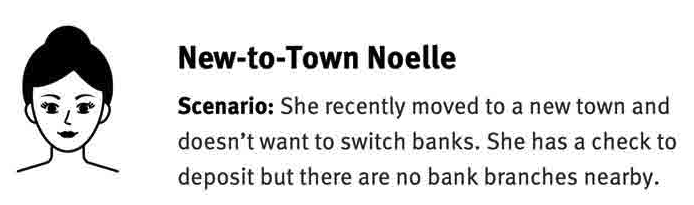
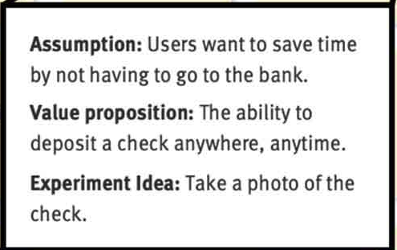
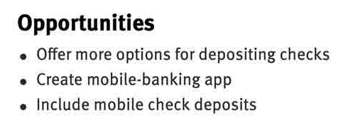
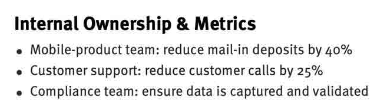
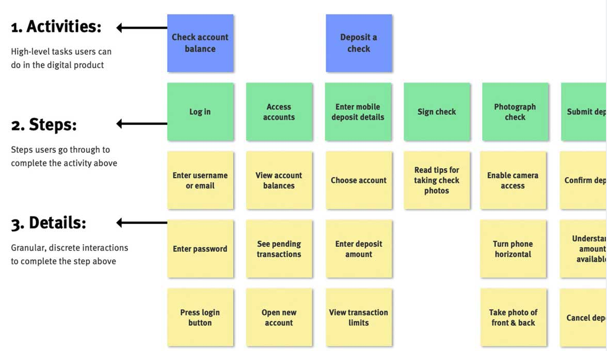

 
# Determine Business Information Flow

## Determine Persona

## Determine Needs and Motivation

## Determine Value Proposition
 

## Determine Opportunities

## Determine Process Ownership

## Determine Subject Areas

## Determine Activities and Scenarios Names

## Determine Activity and Scenario Detail Steps

## Determine Activity Detail Tasks

## Determine Support Activities and Tasks

