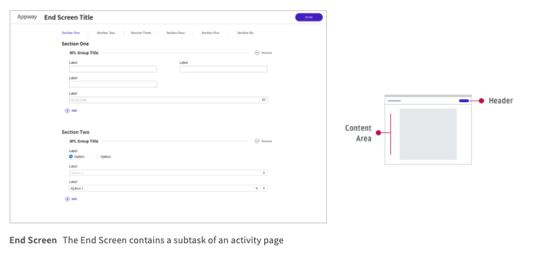
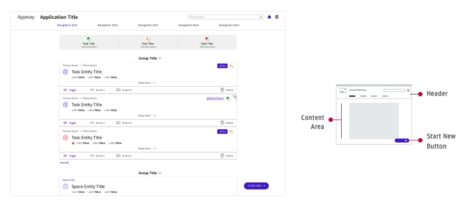
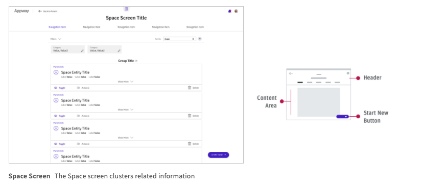

# User Flow

## Prerequisite
Persona

Motivation and Value Proposition

Capability Subject Area

Activities

Activity Output/Outcome/Impact

## Deliverables
Activity diagram for each flow

Detail UX for each view
- layout/spacing
- style guide
- data elements
- ui elements

Estimations for each view

## User Flow Steps
 

## User Flow Activity Diagram
 

## User Flow Layout Diagram
 

## Determine Navigation and View Style
 

# UI References

### Activity View
 

### End View
 

### Launch View
 

### Space View
 

