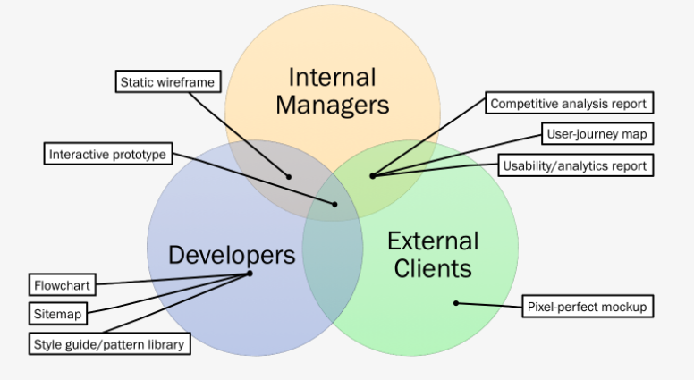
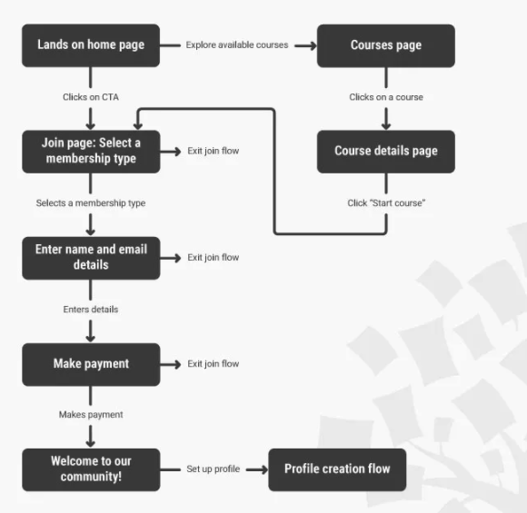
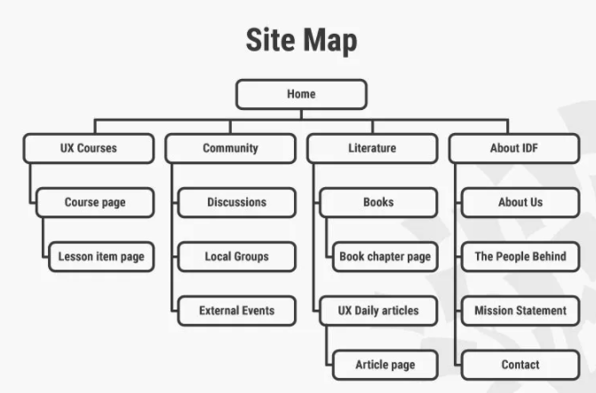
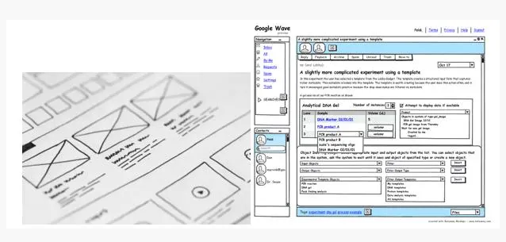
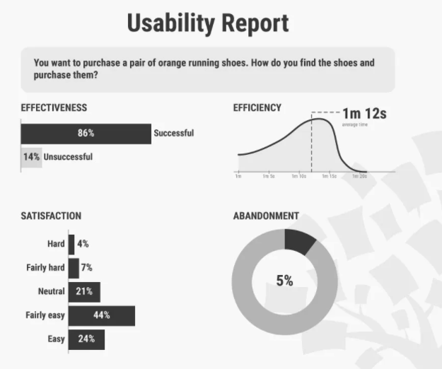
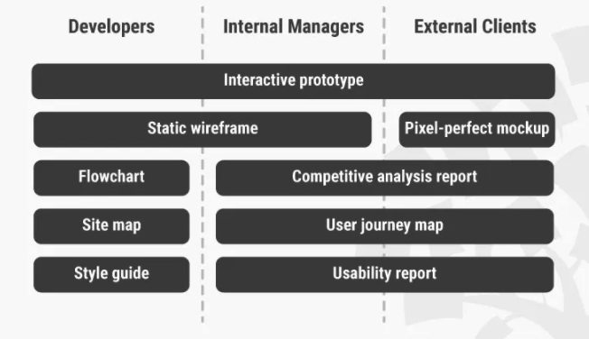
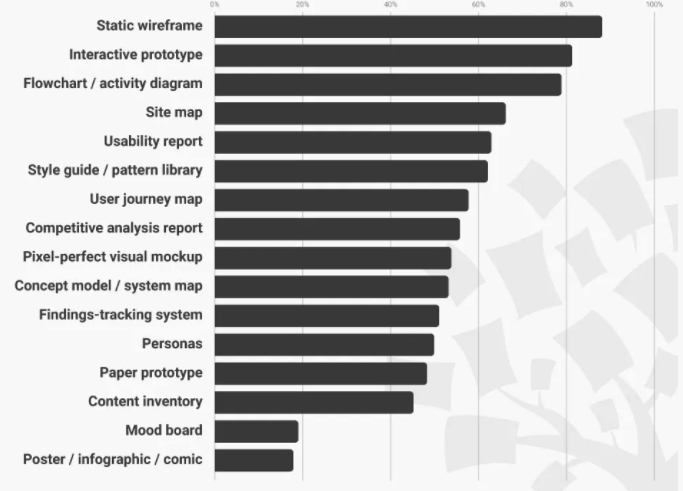
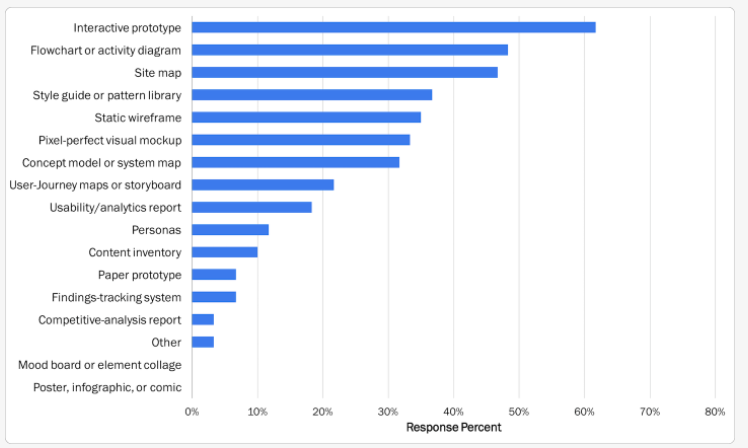

## UX Delivery
 
  
## Artifact Value by Job Role 
 
 

## Activity Diagram
 
 
 
 ## Site Map  
 

 
 ## Low Fidelity  
 

## High Fidelity  
 

 
 ## Usability Report
 

#UX Delivery Reference

## Artifacts
 
 
 ## Most Important Deliverables by Role
 
 
## Artifact Value by Organization Type 
 
 
 
